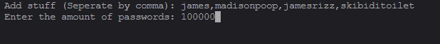
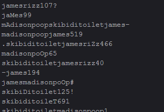

# Broot V1
## Disclaimer: Broot is for educational purposes only and should be used with permission. Any misuse of this software is not at my liability. Use at your own risk.

Broot, the tool to obtain lists of passwords using inputted data.

Adding data

The result (this is only a little bit, theres like a ton more)
